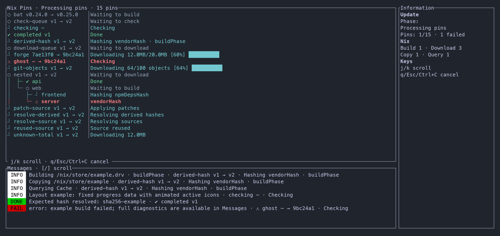

# nix-pins

A Rust CLI that checks upstream versions, locks source and dependency hashes, and writes a JSON Pins File for Nix.



## Usage

Requires Rust, Nix, and a resolvable `<nixpkgs>`. Git-based checks also require `git`.

```sh
cargo install --path crates/cli --locked
nix-pins update
nix-pins status
```

Declare Pins in `pins-config.nix`:

```nix
{ pin }: {
  patchelf = pin.github "NixOS/patchelf";
}
```

`update` writes `pins.json`, preserving previous results for failed Pins. `status` is read-only. Import [`nix/pins.nix`](nix/pins.nix) to use locked sources in Nix.

See the [documentation](https://nix-pins.ercao.dev), [configuration reference](docs/content/en/3.reference/2.configuration.md), and [examples](examples).

## Development

```sh
cargo test --all-targets -- --test-threads=1
cargo clippy --all-targets -- -D warnings
cargo fmt --check
```

Network and dependency-build tests are ignored by default and require their own environment setup.

The CLI lives in `crates/cli/`, shared Nix code in `nix/`, the [documentation site](docs/README.md) in `docs/`, and internal design notes in `design/`. The Flake supports Linux on x86_64 and aarch64, and macOS on Apple Silicon.
